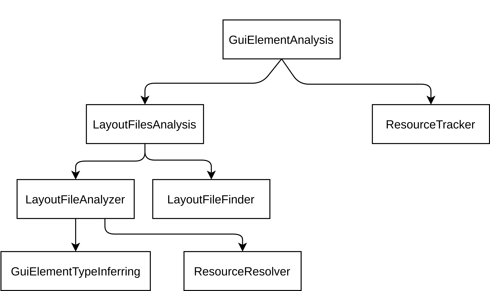

# GuiElementTypeAnalyzer


## What is this tool

The goal of the project is to statically extract information about GUI elements of an android app.

Additionally for GUI elements that are accessed inside of Android Activities, Fragments, etc..., a link from the variable to the GUI element should be created. This way an analyst or a subsequent analysis can track where those Gui Elements are used throughout the control flow of the application and where there are possible sinks.


This project was done in a single week for an assignment in a Static Program Analysis Course at the University of Luxembourg. Thus please be pragmatic and reasonable, the project is in now way perfect.

## Motivation

When tracking input data, such as in a Taint Analysis, it is not always known what data is worth following along the control flow of the application.

> A Gui Element that holds the string “Car” is most likely not worth tracking.
 
> Whereas a Gui Element that holds a credit card number is critical to follow.


What can we do to support an analyst in making this decision?

The more information the analyst has about the data that a Gui Element holds, the better the analyst and my tool can guess with heuristics what the type of the data is and if it worth tracking or not.


This information is available as a JSON output that can be further analyzed by an analyst or some program. Or the tool can be used in its API mode inside some other static analysis.


## How to run

To run the static analysis tool, simply pass in as the first argument the `.apk` file that you wish to analyze and as the second parameter pass in the android `.jar` file that contains the platform jars.

Ex:

```
~/Downloads/app-debug.apk ~/Downloads/android.jar
```


## Overview




- `GuiElementAnalysis` is a facade that acts as the centralized access point to the Tool.

- `ResourceTracker` is a analysis that tries to find all all variables that hold a reference to a Gui Element and then tries to resolve the resource id held by those variables.

- `LayoutFilesAnalysis` retrieves all layout files from the apk, parses the Layout File using Soot/axml, retrieves all the attributes of interest, resolves resources such as  ‘@string/email_address_label’ and finally links all the variables, found by ResourceTracker to the respective Gui Elements.

- `ResourceResolver` tries to resolve String resource references such as ‘@string/email_address_label’ into their constant value ‘Enter your email here’.

- `GuiElementTypeInferring` is a heueristc, albeit rudimentary, that tries to infer the type of a GuiElement based on attributes that either dictate the type of the data or hint at the type of the data. Moreover it performs pattern matching on the string values held by certain elements.


## Future Work

The resource tracker is sound but surely not complete and requires a lot of work in order to correctly track resource ids and their propagations throughout the the android application.